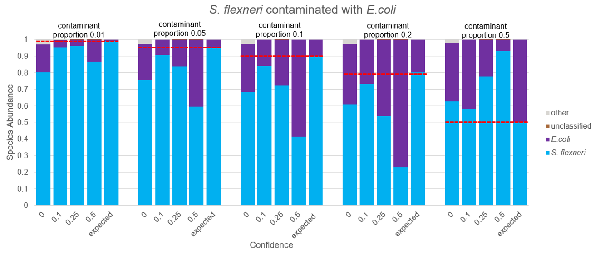
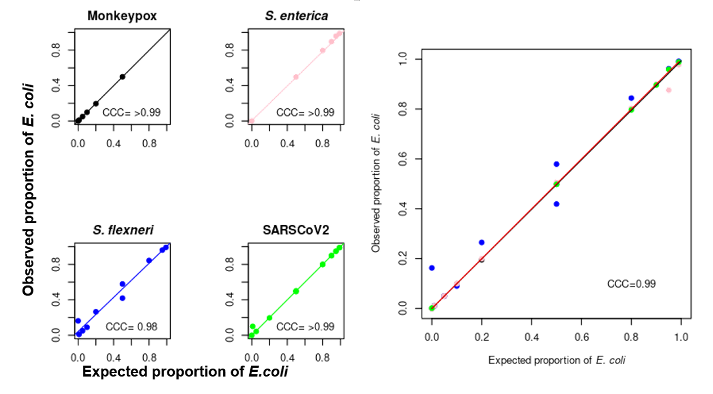
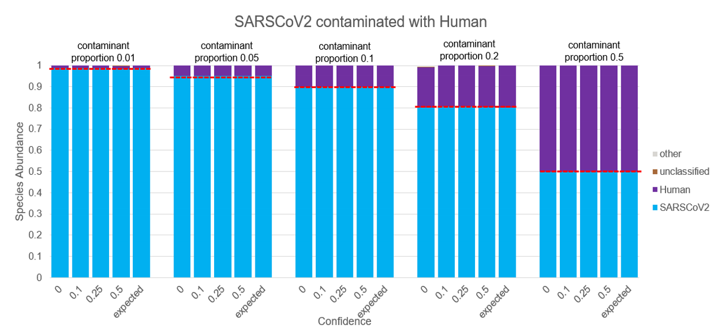
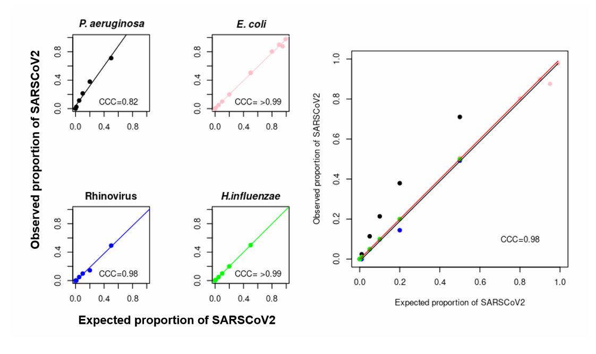
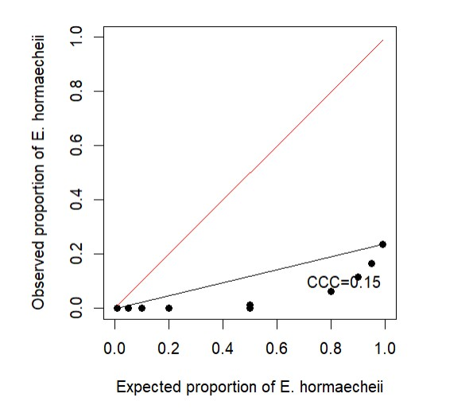
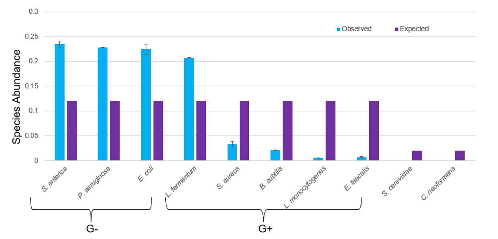

# NML Test Summary Package - Species Abundance Pipeline Validation

------

| **SOP Code:** | N/A |
|---|---|
| **Title of Method:** | Species Abundance Pipeline  |
| **Scope of Method:** | To describe and validate the pipeline used for the estimation of relative abundance of species in a sample. This pipeline can be used to determine the composition of metagenomic samples as well as to detect any contaminants in a sample. |

**Part 1: Test Description**
<table>
  <tr>
  <td>
    <b>Diagnostic Application:&emsp;</b> </td>
    <td>□ Primary Diagnostics	 □ Confirmatory Testing	 ■ Lab Surveillance&emsp;</td>
  </tr>
  <tr>
    <td colspan="2">
      &emsp;□ 1. Association of Official Analytical Chemists (AOAC) 
      &emsp;□ 2. Clinical and Laboratory Standards Institute (CLSI) 
      &emsp;■ 3. Protocol from a peer-reviewed published method 
      &emsp;□ 4. Commercial assay for diagnostic purposes 
      &emsp;□ 5. Commercial assay for research purposes 
      &emsp;□ 6. Modified/adapted protocol from a published method 
      &emsp;□ 7. Modified/adapted commercial assay for diagnostic purposes 
      &emsp;□ 8. Modified/adapted commercial assay for research purposes 
      &emsp;□ 9. In-house developed 
      &emsp;□ 10. Other:   
    </td>
  </tr>
  <tr>
    <td colspan="2">
      <b>Software-specific Test Description:</b> 
      &emsp;1. Tool/data/database update – development of a new process into a standardized pipeline 
    </td>
  </tr>
  <tr>
    <td>
      <b>Type of Study Performed:</b>
    </td>
    <td>
      &emsp;Verification   
      &emsp;<b>Validation</b>
    </td>
  </tr>
</table>

-----

## 1. Summary

Metagenomic sequencing has vastly improved our ability to detect and characterize different microbes in a sample. While various bioinformatics tools are available today to classify the different taxa and estimate their relative abundance, one of their primary challenges is to identify all the species present in a metagenomic sample. The species abundance pipeline that utilizes Kraken2, a taxonomic classification tool, and Bracken (Bayesian Reestimation of Abundance after Classification with KrakEN), a relative species abundance estimation tool, was developed to address this challenge. This pipeline can be integrated into Galaxy and IRIDA, providing a user-friendly version accessible to a wide variety of users.
Briefly, the pipeline's Galaxy workflow can be run on paired-end Fastq reads as input. Subsequent steps include: read preprocessing using fastp, k-mer based taxonomic classification of the processed reads by Kraken2, and species level abundance estimation by Bracken using Kraken2 assigned taxonomy labels. **This pipeline was found to be fit for purpose in identifying the tested common contaminants across varied sample types**
 
The validation of this species abundance pipeline was performed using in-silico and mock community data comprising different organisms as contaminants in any given sample. Overall, this pipeline performed well at accurately identifying most contaminants present in samples, and estimating their abundance.

## 2. Purpose

Validate that the species abundance pipeline (implemented in a Galaxy workflow) accurately identifies varied levels of contamination in a sample, including through estimation of contaminant species' abundance. Also, this analysis investigated the effect of a)application of confidence thresholds to data interpretation; b) call accuracy for samples composed of near neighbour closely related species and; c) contaminant identification in lower proportions in a sample, on result generation. Note that the list of organisms tested was not exhaustive, but rather focused on a targeted list of commonly detected/contaminant organisms. Users of this software with specific needs should investigate the utility of this program in their specific context.

## 3. Datasets

Two types of data were used to test this pipeline in Galaxy- **1)** in-silico data and; **2)** mock microbial community data. 
 
To test the accuracy of the pipeline, **In silico data** was generated from a diversity of organisms (e.g. bacteria, viruses) representing various genomic content (e.g. genome sizes, GC content, plasmid content). Reference genomes for these organisms were retrieved from NCBI RefSeq and used for generating paired end sequences.

- The list of organisms used in the in-silico data generation along with their NCBI taxon ids and genomic information is located at - [List_of_organisms.xlsx](https://doi.org/10.5281/zenodo.7994845)
 
- NCBI RefSeq for the organisms are located at - [RefSeq_accessions.xlsx](https://doi.org/10.5281/zenodo.7994845)
 
- The simulated reads generated using NCBI RefSeq database for each organism are located at- https://doi.org/10.5281/zenodo.7994845

 
**Mock community** sample comprising 8 bacterial species, including both G- and G+ bacteria as well as 2 yeasts (from https://zymoresearch.eu/collections/zymobiomics-microbial-community-standards ) was used to obtain sequences (Illumina paired-end, 150bp) for testing the pipeline in Galaxy.
 

## 4. Procedure

  i) Generation of in-silico data and pipeline run

- Using a short read simulator (https://github.com/dfornika/simulate-short-reads) paired-end, 150bp reads were generated from the reference sequences. A variety of samples with different contaminants were produced using this tool. Different sample types included commonly sequenced organisms spiked with commonly identified contaminant species from the laboratory (e.g. bacteria, viruses, human). As well, special cases were created whereby near identical species were included as contaminants (e.g.  _Escherichia coli_ & _Shigella flexneri_).

- For generating the sequencing reads using the simulator, reference sequence of the contaminants used in each sample type as well as the proportion of contaminants used were specified. The levels of contaminants tested ranged 1% to 50%.
 
- The reads resulting from in-silico data generation were then run through the species abundance pipeline on Galaxy. The following parameters were changed from default while running the pipeline:
  - Kraken2 database -> Standard (Prebuilt) full 2021 (https://benlangmead.github.io/aws-indexes/k2)
  - Kmer distribution --> 150bp
  - Confidence scores -> 0,0.1,0.25,0.5, (default=0)
 
 
ii)	Mock community 
 
 
Because the in-silico data does not account for the variation in wet-lab procedures used for nucleic acid extractions and sequencing, mock community data was also used to validate the species abundance pipeline. A commercially available mock community sample (ZymoBIOMICS Microbial Community Standard (zymoresearch.com)) was used 
to test the pipeline. This sample comprised 5 G+, 3 G- bacteria and 2 yeasts (see Table 1). DNA from the sample was extracted using Mag-Bind ® Universal Pathogen DNA-96 Kit and 150bp, paired-end sequences were generated using Illumina platform. These sequences were then run through the species abundance pipeline on Galaxy.
 
 
**Table 1**: Theoretical composition of the mock community sample.

| Organism	| Theoretical Proportion	| Gram Stain	| 
|---|---|---|
|_Salmonella enterica_ |0.12|-|
|_Pseudomonas aeruginosa_|0.12|-|
|_Escherichia coli_|0.12|-|
|_Bacillus subtilis_|0.12|+|
|_Listeria monocytogenes_|0.12|+|
|_Lactobacillus fermentum_|0.12|+|
|_Enterococcus faecalis_|0.12|+|
|_Staphylococcus aureus_|0.12|+|
|_Saccharomyces cerevisiae_|0.02|n/a|
|_Cryptococcus neoformans_|0.02|n/a|

## 5. Results

The species abundance pipeline was able to identify most tested organisms in a given sample for both the in-silico and mock community data. Throughout the trialed datasets, applying a confidence score of 0.1 improved the reliability of estimates of sample composition.
 
**In-silico data**
 
*Near neighbour identification*

The pipeline was able to detect both _S. flexneri_ and _E. coli_ in a sample at all contamination levels tested, and the estimated abundance of each species was observed to approximate the expected abundance at a confidence score of 0.1 (Figure 1).  

**Figure 1**. Abundance estimation of species in a sample containing _S. flexneri_ contaminated with different proportions of _E.coli_.  Different contaminant levels/proportions and confidence scores tested are shown on the top and bottom of the graphs, respectively. Expected abundance values based on the in silico data are indicated by the last bar on each graph, and the dashed line.
 

To quantify concordance between the observed and expected values of all the species' abundance in a sample, a **Concordance Correlation Coefficient (CCC)** was calculated for abundance estimated at a confidence score threshold of 0.1. In four different samples containing different contaminants, the CCC of _E. coli_ was calculated approach 1, suggesting the accuracy of the relative abundance estimation for this pipeline in quantifying _E.coli_ across samples (Figure 2).

**Figure 2**. Concordance correlation coefficient (CCC) of the observed and expected proportions of _E. coli_ in different samples containing different organisms as contaminants. Four small plots on the left show the individual CCCs of _E. coli_ when mixed with other organisms whereas the larger plot on the right shows all the different samples on one graph to show the overall CCC of the observed and expected proportions of _E.coli_. CCC ranges from -1 to 1, where 1 indicates perfect agreement. 
 

*Human contaminant identification*

The pipeline was demonstrated the ability to detect more distant species, identifying both SARS-CoV-2 and the contaminant Human in a sample at all the different proportions of the contaminant. However, in this example application of the confidence score threshold did not affect the pipeline's output (Figure 3).

**Figure 3**. Abundance estimation of species in a sample containing SARS-CoV-2 contaminated with different proportions of human.  Different contaminant levels/proportions and confidence scores tested are shown on the top and bottom of the graphs, respectively, and the expected abundance of each species in the sample tested are indicated by the last bar on each graph.
 

*Bacteria and viral identification*

In four different samples containing different contaminants the CCC of SARS-CoV-2 was calculated to be approximately 1 in each sample except the one containing Pseudomonas aeruginosa indicating organism specific effect on CCC values (Figure 4).

**Figure 4**. Concordance correlation coefficient (CCC) of the observed and expected proportions of SARS-CoV-2 in different samples containing different organisms as contaminants. Four small plots on the left show the individual CCCs of SARS-CoV-2 when mixed with other organisms whereas the larger plot on the right shows all the different samples on one graph to show the overall CCC of the observed and expected proportions of SARS-CoV-2. CCC ranges from -1 to 1, where 1 indicates perfect agreement. 
  

*Organism specific effect on abundance estimation*

In a third example, the observed and expected abundance estimates of _Enterobacter hormaechei_ and the contaminant _Enterobacter cloacae_ were observed to be very different, i.e. lower observed than expected in case of _E. hormaechei_ and higher than expected in case of _E. cloacae_ at a confidence score of 0.1 (Figure 5a), highlighting the inaccuracy of pipeline in this case.

**Figure 5a**. Abundance estimation of species in a sample containing _E. hormaechei_ contaminated with different proportions of _E. cloacae_.  Different contaminant levels/proportions and confidence scores tested are shown on the top and bottom of the graphs, respectively, and the expected abundance of each species in the sample tested are indicated by the last bar on each graph.
 

A low CCC value (0.15) for the observed and expected proportions of _E. hormaechei_ further showed that this species is not detected well by the pipeline.

**Figure 5b**. Concordance correlation coefficient (CCC) of observed and expected proportion of _E. hormaechei_ .
 

In two different samples containing different contaminants the CCC of _E. cloacae_ was calculated to be very different (0.28 with  _E. hormaechei_ vs 0.99 with  _Clostridium difficile_). This demonstrated the inaccuracy of the pipeline at detecting _E. cloacae_ and also how this inaccurate relative abundance estimate of one organism impacted the relative abundance estimate of the other organism in a sample (Figure 6).

**Figure 6**. Concordance correlation coefficient (CCC) of the observed and expected proportions of _E. cloacae_ in different samples containing different organisms as contaminants. Four small plots on the left show the individual CCCs of _E. cloacae_ when mixed with other organisms whereas the larger plot on the right shows all the different samples on one graph to show the overall CCC of the observed and expected proportions of _E. cloacae_. CCC ranges from -1 to 1, where 1 indicates perfect agreement. 
 
 
CCC values for each of the comparisons investigated as part of this study, are included in Table 2.

 **Table 2**. Concordance Correlation Coefficient (CCC) values for the organisms tested using the species abundance pipeline.

| Organism	| Theoretical Proportion	|
|---|---|
|_S. enterica_|>0.99|
|_M. tuberculosis_|>0.99|
|_M. abscessus_|>0.99|
|_L. monocytogenes_|>0.99|
|_H. influenzae_|>0.99|
|_N. gonorrhoeae_|>0.99|
|_S. pyogenes_|> 0.99|
|Monkeypox|>0.99|
|Rhinovirus|>0.99|
|HIV1|>0.99|
|Human mastadenovirus E|>0.99|
|Influenza A|>0.99|
|Measles virus|>0.99|
|Human mastadenovirus E|>0.99|
|Human parainfluenza 1 virus|>0.99|
|_L. pneumophila_|>0.99|
|_E.coli_|0.99|
|Hepatitis C|0.99|
|Hepatitis B|0.99|
|_C. jejuni_|0.99|
|_K. pneumoniae_ |0.99|
|SARSCoV2|0.98|
|_C. werkmanii_|0.97|
|_C. freundii_|0.97|
|_C. difficile_|0.95|
|_S. flexneri_|0.94|
|_B. anthracis_|0.9|
|Rotavirus A|0.85|
|_P. aeruginosa_|0.84|
|_C. beijerinckii_|0.74|
|_E. cloacae_|0.5|
|_B. cerus_|0.44|
|_R. ornitholytica_|0.33|
|_E. hormaechei_|0.15|
 
**Mock community data**
 
While using the mock community data with the pipeline the observed species abundance for all the organisms in a sample were found to be different from the expected abundance (Figure 7).

**Figure 7**. Bracken output showing observed species abundance of the mock communities compared to the expected proportion as indicated by the manufacturer.
 
 
**Conclusion**

The species abundance pipeline was able to detect most tested contaminants in a given sample, and the observed relative species abundance proportions were found to be close to the expected proportions when a confidence score of 0.1 was applied. However, the CCC values were skewed in some cases, based on the combination of organisms input in the sample (e.g. _E. hormacheii_ and _E. cloacae_; See Figure 5a,b; 6). Species abundance estimates produced from this pipeline should be evaluated by users, with specific knowledge of the identified organism in question in order to verify results. This pipeline has been found to be fit for purpose in the detection of contaminant organisms in whole genome and/or metagenomic samples. 

 
 
 

